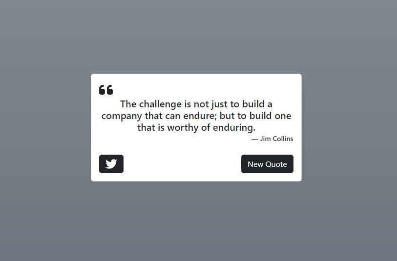

# Random Quote Machine

   

  ## Description
  
  This is a random quote machine for freeCodeCamp.com's front end library certification.

  [Project Requirements](https://www.freecodecamp.org/learn/front-end-development-libraries/front-end-development-libraries-projects/build-a-random-quote-machine)

  [Random Quote Machine](https://jfranklin12.github.io/random-quote-machine/)

   

  ## Table of Content
  - [Installation](#installation)
  - [Usage](#usage)
  - [Contributing](#contributing)
  - [Tests](#tests)
  - [Questions](#questions)
  - [License](#license)

  ## Installation

  To install, run ```npm i``` in the command line.

  ## Usage

  This application is open for anyone to use 🙂

  ## Contributing

  This project is not accepting contriputions at this time.

  ## Tests
  
  There are no test to run at this time.

  ## Questions

  If you have any questions, contact me at 2ms.jfranklin@gmail.com. Visit my GitHub page at [jfranklin12](https://github.com/jfranklin12/) to see my other projects.

  ## Liscence
    
This projected is licensed under MIT.

  https://opensource.org/licenses/MIT
